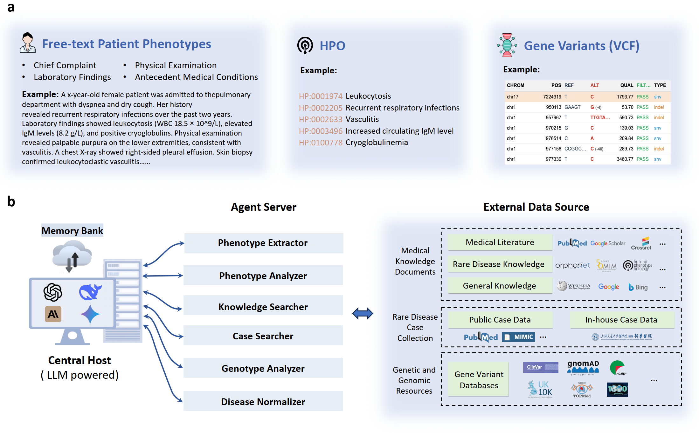

# DeepRare (Fork): Rare Disease Diagnosis with Traceable Reasoning

This repository is a fork derived from the codebase released by the authors of the Nature paper:

**"An agentic system for rare disease diagnosis with traceable reasoning."**

## Acknowledgement to the Original Authors

We sincerely thank the original authors for making their implementation publicly available and for establishing a strong scientific and engineering foundation for AI-assisted rare disease diagnosis. This fork is directly enabled by their contribution.

## Scientific Concept Behind the Paper

The central contribution of DeepRare is the integration of:

1. A large language model (LLM) capable of structured clinical reasoning over heterogeneous inputs.
2. A multi-agent framework with specialized tools for phenotype extraction (HPO), biomedical evidence retrieval, and genomic analysis.
3. A traceable diagnostic output in which each ranked hypothesis is supported by an explicit, verifiable evidence chain.

Rather than producing a single opaque prediction, the system generates ranked rare disease hypotheses and justifies them through clinically interpretable intermediate reasoning steps.



## Scope of This Fork

In this fork:

1. The original repository was cloned and adapted for practical local execution.
2. The genomic workflow was adjusted to reduce hard dependency on Exomizer in lightweight environments.
3. Variant interpretation is performed through **VEP** (Ensembl Variant Effect Predictor) REST API calls when Exomizer is unavailable.

### Exomizer Versus VEP in This Implementation

- **Exomizer** is a robust gene-prioritization framework, but it typically requires a heavy local setup (Java runtime and large reference databases).
- **VEP via REST API** provides a lighter annotation pathway without full local Exomizer deployment.

In the current implementation, [diagnosisGene.py](diagnosisGene.py) attempts to run Exomizer when a valid JAR is configured. If it is not found, the pipeline falls back automatically to VEP-based analysis.

### What VEP Is

**VEP (Variant Effect Predictor)**, maintained by Ensembl, annotates variants from VCF input and returns biologically relevant signals for prioritization, including:

- molecular consequence classes (e.g., missense, frameshift)
- predicted functional impact
- in silico pathogenicity indicators (e.g., SIFT, PolyPhen)
- population allele frequencies
- ClinVar-related annotations, when available

In this fork, these annotations are used to construct candidate variant rankings and generate an interpretable summary for downstream diagnostic reasoning.

## System Requirements

### Hardware

- RAM: 16 GB minimum (32 GB recommended)
- Storage: 100 GB free space recommended
- GPU: optional

### Software

- Python 3.8+
- Node.js 18+ (for the web interface)
- Java 21+ (only required if Exomizer is used)
- Chrome and a compatible ChromeDriver version

## Local Setup (CLI Workflow)

### 1. Clone and Install Dependencies

```bash
git clone <YOUR_FORK_URL>
cd DeepRare
python -m venv .venv
# Linux/macOS
source .venv/bin/activate
# Windows PowerShell
# .\.venv\Scripts\Activate.ps1
pip install -r requirements.txt
```

### 2. Download the Dataset

```bash
huggingface-cli download Angelakeke/DeepRare --repo-type=dataset --local-dir ./database
```

### 3. Configure ChromeDriver

- Download a ChromeDriver version compatible with your Chrome installation.
- Set its path in [inference.sh](inference.sh) and [inference_gene.sh](inference_gene.sh) using the `SERVICE_PATH` variable.

### 4. Configure LLM API Keys

Add your keys in:

- [inference.sh](inference.sh)
- [inference_gene.sh](inference_gene.sh)
- [eval.sh](eval.sh)

At least one valid provider key is required (OpenAI, DeepSeek, Gemini, or Claude), depending on the selected model.

### 5. Run Inference

```bash
# HPO-based diagnosis
bash inference.sh

# HPO + VCF (gene-aware) diagnosis
bash inference_gene.sh

# HPO extraction from free text
bash extract_hpo.sh

# Evaluation
bash eval.sh
```

## Local Gene Workflow with VEP

Exomizer installation is not mandatory for initial gene-aware experiments if you use the VEP pathway:

1. Prepare a valid VCF file.
2. Run `bash inference_gene.sh`.
3. If no valid Exomizer JAR is detected, the system will automatically use the VEP API fallback.

To prioritize Exomizer explicitly, install its full environment and update `EXOMISER_JAR` in [inference_gene.sh](inference_gene.sh).

## Local Web Deployment (Optional)

### Backend (FastAPI)

```bash
cd web/backend
pip install -r requirements.txt
python run.py
```

API endpoint: `http://localhost:8000`

### Frontend (React + Vite)

```bash
cd web/frontend
npm install
npm run dev
```

Web UI endpoint: `http://localhost:5173`

## Demo


## Paper Reference

```latex
@article{zhao2026agentic,
  title={An agentic system for rare disease diagnosis with traceable reasoning},
  author={Zhao, Weike and Wu, Chaoyi and Fan, Yanjie and Qiu, Pengcheng and Zhang, Xiaoman and Sun, Yuze and Zhou, Xiao and Zhang, Shuju and Peng, Yu and Wang, Yanfeng and others},
  journal={Nature},
  pages={1--10},
  year={2026},
  publisher={Nature Publishing Group UK London}
}
```

## Note

This fork preserves the core scientific direction of the original project while incorporating practical local-execution adjustments, including a VEP-based genomic analysis pathway when Exomizer is not available.
